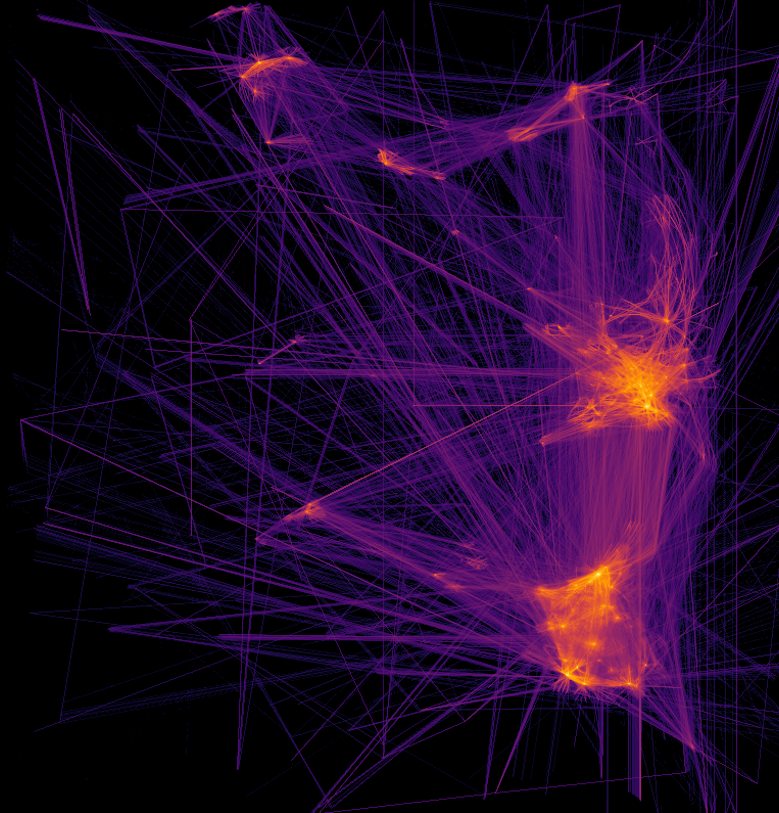
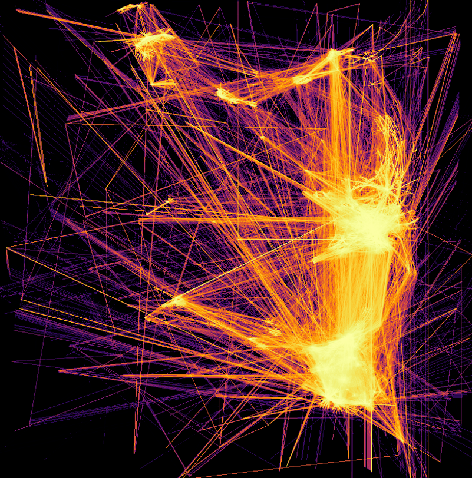

# adsb_wrangler
This project is a data wrangler that collects and processes data from this free online resource: https://www.adsbexchange.com/

## Data Extraction / Collection

The current strategy is for all downloading of the daily zip files (which contain the JSON files for every minute of ADSB data) and all data manipulation to occur in R. I plan on keeping as much within R as possible, but there are going to be a few things I won't be able to do in R or they are just much easier / more feasible to do in Python.

## Datashader Plots -- One Day at a Time

This is the first example of something I haven't been able to figure out how to do in R, but Python is currently equipt to handle. I want to plot millions of geographic points (as well as lines connecting "trips") without losing information to overplotting. One strategy I've used in the past for this type of plot is to lower the alpha (transparency) to almost nothin so that I can see where the density of point are. This is fine, but you won't be able to see any of your outliers. The other strategy is to just succumb to using a heatmap (hexbins from Bokeh work nicely), but you lose so much information with that strategy.

Enter datashader. Every pixel generated from a datashader plot perfectly displays the data with as minimal information loss as possible. No other plotting package that I've seen is able to bin down to the pixel level.

Each of the most recent days I've looked at have contained roughly 16,000,000 records of good Lat/Long values. This is impossible to plot using traditional methods found in base R, ggplot2, or matplotlib (unless you generalize into some form of heatmap).

**Plotting every flight path colored by a count of flight paths overlapping in that pixel bin:**

**Same plot but on a log scale:**

